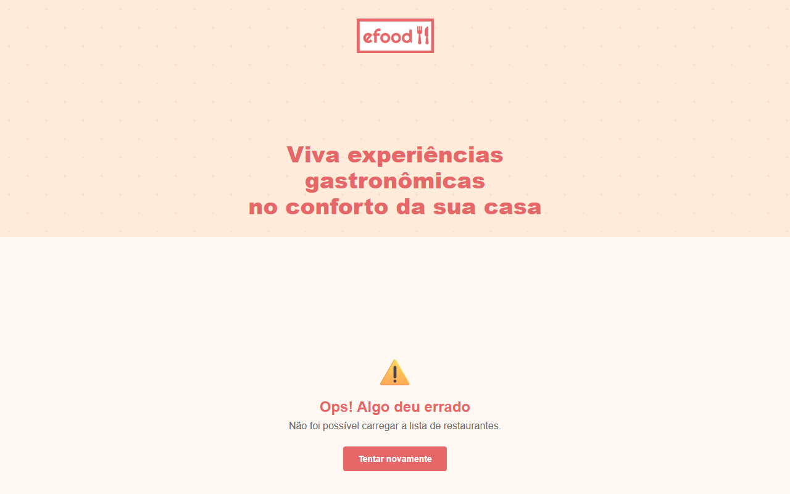

# eFood — Restaurant Delivery Platform


A front-end restaurant delivery application where users can browse restaurants, view detailed menus, add items to cart, and complete orders. Features authentication via Supabase, customer reviews, favorites, address autocomplete via ViaCEP, and geolocation-based distance calculation.

> Projeto desenvolvido como parte da formação Full-Stack, demonstrando domínio de React, TypeScript, Redux Toolkit, integração com APIs REST e boas práticas de desenvolvimento front-end.

[🔗 Acesse a versão de produção](https://efood-app.pages.dev)

## Screenshots

| Home | Restaurant Profile | Checkout |
|:---:|:---:|:---:|
|  |  |  |

## Tech Stack

| Category | Technology |
|---|---|
| **UI** | React 19, Styled Components |
| **Language** | TypeScript |
| **State Management** | Redux Toolkit (slices + RTK Query) |
| **Routing** | React Router DOM v7 |
| **Forms** | Formik + Yup |
| **API Layer** | RTK Query with fetchBaseQuery |
| **Backend** | Supabase (Auth, PostgreSQL, Storage) |
| **External APIs** | ViaCEP (address autocomplete), Geolocation API |

## Features

- **Restaurant listing** — home page with restaurant cards displaying cuisine type, rating, and featured highlights
- **Detailed menu** — restaurant profile page with product modals (photo, description, portion size, price)
- **Shopping cart** — add/remove items with state managed via Redux Toolkit
- **Full checkout flow** — multi-step process: delivery details → payment details → order confirmation
- **Form validation** — real-time validation with Formik and Yup
- **REST API integration** — data fetching for listing, details, and purchase via RTK Query
- **Responsive layout** — interface adapted for desktop, tablet, and mobile screens
- **Supabase Auth** — sign in/sign up with email and password, persistent sessions
- **Favorites** — mark/unmark favorite restaurants (stored in Supabase)
- **Customer reviews** — rating and comment system per restaurant
- **Order history** — completed orders are saved to the user's database record
- **ViaCEP integration** — address autocomplete at checkout (auto-fills street, city, and state from ZIP code)
- **Geolocation** — calculates and displays distance from user to each restaurant using the Geolocation API and Haversine formula

## Getting Started

**Prerequisites:** Node.js 16+ and npm

```bash
# Clone the repository
git clone https://github.com/viniciussilva2504/efood.git
cd efood

# Install dependencies
npm install

# Set up environment variables
cp .env.example .env
# Fill in REACT_APP_SUPABASE_URL and REACT_APP_SUPABASE_ANON_KEY

# Start the development server
npm start
```

The application will be available at `http://localhost:3000`.

## Project Structure

```
src/
├── components/       # Reusable UI components (Cart, Checkout, AuthModal, ReviewList, etc.)
├── contexts/         # React Contexts (AuthContext, CartContext)
├── hooks/            # Custom hooks (useGeolocation)
├── pages/            # Application pages (Home, Perfil, Admin)
├── store/            # Redux store and reducers (Cart slice)
├── services/         # API services (RTK Query, Supabase, ViaCEP)
├── models/           # TypeScript type definitions (Cardapio, Checkout)
├── styles/           # Global styles
├── utils/            # Utility functions (formatters)
└── routes.tsx        # Route configuration
```

## Available Scripts

| Command | Description |
|---|---|
| `npm start` | Start the development server |
| `npm test` | Run tests |
| `npm run build` | Create a production build |

## Roadmap

- [x] Authentication with Supabase (sign in, sign up, sessions)
- [x] ViaCEP integration for address autocomplete at checkout
- [x] Geolocation with distance calculation
- [x] Reviews and favorites system with Supabase
- [ ] Migrate to Next.js (App Router + SSR) for better SEO and performance
- [ ] E2E tests with Cypress for complete checkout flow
- [ ] PWA with service worker for offline support

## Author

**Vinicius Silva** — Frontend Developer · React + TypeScript

- GitHub: [@viniciussilva2504](https://github.com/viniciussilva2504)
- LinkedIn: [Vinicius Silva](https://www.linkedin.com/in/viniciussilva2504/)

---

> Projeto desenvolvido como parte da formação Full-Stack, demonstrando domínio de React, TypeScript, Redux Toolkit, integração com APIs REST e boas práticas de desenvolvimento front-end.

[🔗 Acesse a versão de produção](https://efood-app.pages.dev)